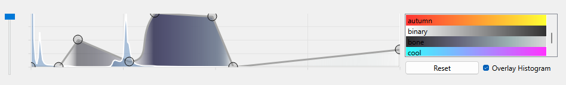

# Strangevis 3D Volumetric Renderer

## Prerequisites
* CMake 3.16
* C++20
* Qt 6.2
* Conan

Tested on Windows 10 and 11 using Visual Studio 2022 and Ninja.

## Building
To build, simply open the projects 'CMakeLists.txt' in Qt Creator, configure for the correct compiler and build.

Alternatively, open a developer command prompt for Visual Studio 2022 and run build.bat.
You will likely have to update the -DCMAKE_PREFIX_PATH in build.bat to point at your own Qt install. It requires Conan, cmake and Ninja are available on the path. Conan can be installed as a python package using

    pipx install conan

Running build.bat will build the release version of the program in build/bin with all necessary libraries included.

Optionally you can open the project in Visual Studio 2022 and it should be more or less ready to build without further configuration.

## The Application

The program consists of a 3D and 2D view. The 3D view contains the main model rendered using DVR and blinn-phong shading, as well as a number of gizmos for interaction. The top left gizmo can be used to center the camera along and midway between the main orthogonal axis. The bottom left gizmos control the plane interaction tool, which is used for several things.

A moveable light source can be controlled using the options in the top left, and moved by holding shift and click and hold dragging the mouse pointer.

The bottom left portion of the 3D view contains options for changing the volumetric rendering.

## Transfer Function
The Transfer Function tool is below the 3D view. This tool consists of a graph showing alpha vs data-value, and a list of pre-existing colormaps.

The graph is manipulated by adding and removing control points using left and right click respectively. The points can then be dragged around. The rendering is updated immediately. The 2D slice uses the colormap, but not the alpha values.

By default, linear interpolation is used between control points, though by double clicking the control points a spline interpolation tool can be activated.

The green interaction widgets can be dragged to create the desired curve between control points.

The histogram of the dataset can be overlayed on the transfer-function as a guide. By using the slider on the left the histogram can be zoomed on the y-axis to help see the existence of less frequent values.

The reset button removes all user-created control points.

## 2D View
The 2D view shows a single slice of the volume determined by the plane interaction tool. The slice can be rotated using the dial in the bottom right, and flipped vertically or horizontally if desired. A Reset button in the bottom right will move the slice back to the default position and orientation. The slice can be zoomed in and out of by using the scroll wheel.

By clicking and dragging a red selection marker is displayed on the slice. This marker will also be displayed on the corresponding spot in the 3D view if the "Show Slice" configuration option is enabled. The interaction does not work in the reverse direction, and the point cannot be further interrogated.

## Plane Interaction

The plane interaction tool consists of the two gizmos in the bottom left of the 3D view. The plane is overlayed on the model if the Show Slice option is enabled. The bottom gizmo can be used to rotate the plane by 15 degree increments around the world orthogonal axis. The upper tool can be used to move the plane along those axis. The 2D slice view updates immediately to show the rendered slice.

## Sliced View

